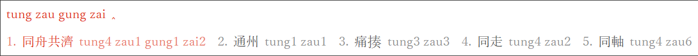
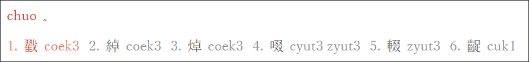
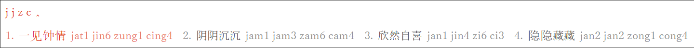

# rime-cantonese

Rime Cantonese input schema (The Linguistic Society of Hong Kong Cantonese Romanisation Scheme)

Rime 粵語拼音輸入方案（香港語言學學會粵語拼音方案）

## Features

(1) Input words by Cantonese romanization (Jyutping)

(2) Reverse lookup Cantonese by romanization of Standard Chinese (Hanyu Pinyin)

(3) Other features like acronym and Simplified Chinese

## Data Source

Dictionary data are built from [sgalal/rensyuugi](https://github.com/sgalal/rensyuugi/tree/master/index.files/cantonese), an extensible word reciting framework that supports multiple languages.

The data are indirectly from [sgalal/lexi_can_crawler](https://github.com/sgalal/lexi_can_crawler#decoding-problem), the crawler for Cantonese pronunciation data on Research Institute for the Humanities, Faculty of Arts, The Chinese University of Hong Kong (粵語審音配詞字庫).

## License

Code for build the data is distributed under MIT license.

Dictionary data follows the original license.
